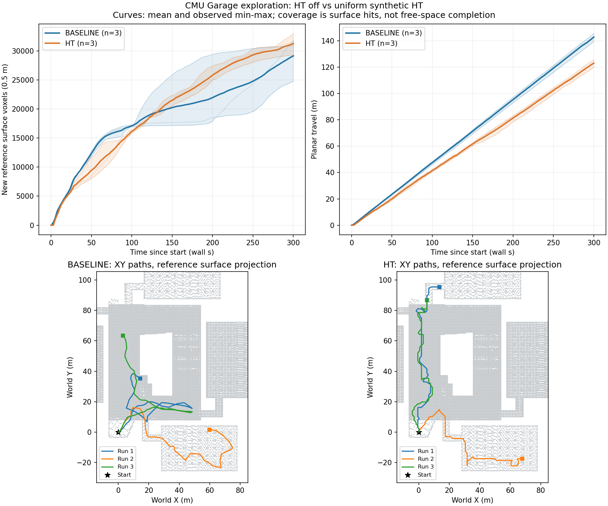
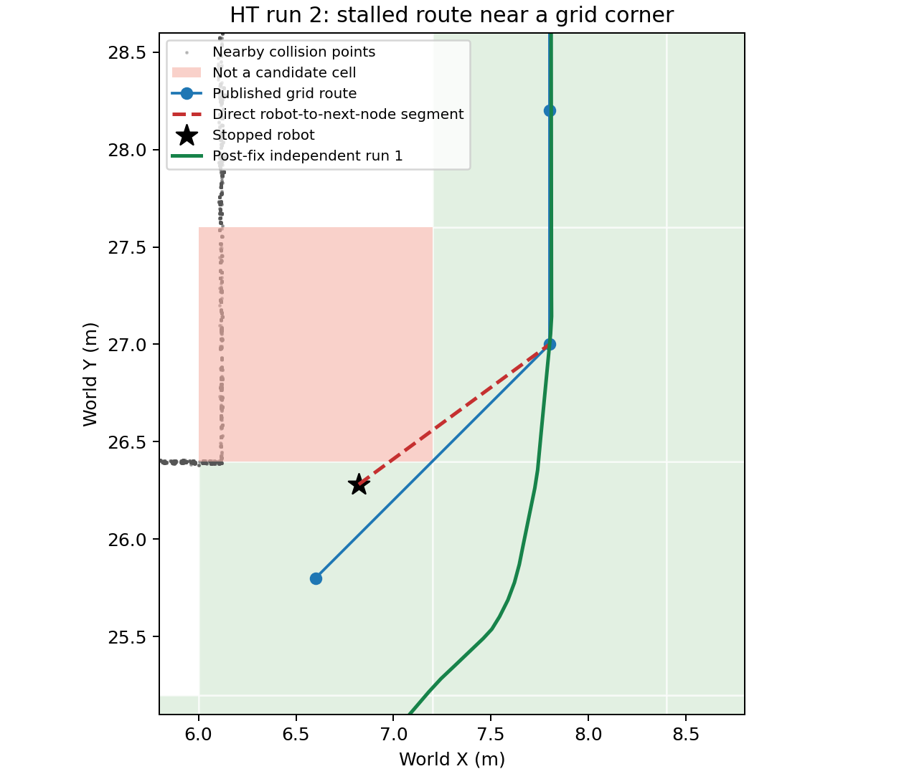

# CMU Garage 探索能力评估与拐角修复

用途纠正（2026-09-21）：本报告仅用于探索流程和运动稳定性回归，**不能证明道路通过性筛选能力提升**。通过性指标、固定脚本和真实标注数据接入方式见 [道路通过性评测](experiments/traversability/README.md)。

实验日期：2026-09-20。共 9 次运行，每次 300 秒，累计 45 分钟有效测量。

**评判：当前修复版在本次三次 5 分钟车库复测中均能持续探索，未观察到持续低速停滞；探索覆盖与关闭 HT 的基线相近，本次覆盖均值略高。尚不能据此宣称已具备整座车库探索完成能力，或证明真实 HT 模型有优势。**

原版本在三次 HT 运行中有一次从约 81 秒停到 300 秒结束，说明之前的短时移动及故障恢复验证不足以证明探索稳定性。该失败已保留在统计中，随后修复并进行了独立复测。

## 实验与指标

- CMU Jazzy Garage，相同起点，速度上限 0.5 m/s，每次重新启动仿真。
- 基线为同一代码关闭 HT；初始基线和 HT 各 3 次，交替次序为 B1、H1、H2、B2、B3、H3。
- 初始规划代码为 `c4b7a41`；原始实验工具和数据归档在 `e1afe89`。所有初始运行结束后才修复；复测规划代码为 `df8815c61a22a76d0314d372e4c280ac233ee23c`。
- 修复后另跑 HT 3 次；复用之前的三次基线，没有重新交替运行基线。初始实验在当日凌晨，复测在下午；采样使用上游 `std::random_device`，未固定随机种子。
- 输入为 **80 m × 80 m、0.5 m 分辨率、5 Hz、八方向均为 0.9 的合成 HT 地图**。没有运行真实地形推理模型，也没有注入故障。
- 主指标：正式开始后新增命中的参考表面体素。激光和官方参考 PLY 均映射到固定世界坐标的 0.5 m 网格，去重后求交集，扣除预热已见部分。
- 参考地图共 339,912 个表面体素，九次初始命中均为 1,367 个。累计命中率的分母包含多层及可能不可到达的表面，**不是已探索自由空间百分比**。CMU 的 `/explored_volume` 同样是命中体素体积，仅作辅助记录。

## 结果

下表为三次运行的均值 ± 样本标准差；规划耗时先计算每次运行的中位数/P95，再对三个值汇总。

| 指标 | 基线：HT 关闭 | 修复前 HT | 修复后 HT |
|---|---:|---:|---:|
| 新增参考表面体素（主指标） | 29,146 ± 3,838 | 24,203 ± 10,880 | 31,248 ± 1,868 |
| 参考表面累计命中率 / % | 8.98 ± 1.13 | 7.52 ± 3.20 | 9.60 ± 0.55 |
| 平面行驶距离 / m | 142.8 ± 3.1 | 93.5 ± 51.6 | 123.0 ± 2.9 |
| 每米新增参考体素 | 204.5 ± 30.6 | 279.4 ± 55.8 | 254.0 ± 14.7 |
| 低速停留总时长 / s | 0.0 ± 0.0 | 73.0 ± 126.4 | 0.0 ± 0.0 |
| 规划周期中位数 / ms | 235.2 ± 10.5 | 229.3 ± 9.6 | 232.3 ± 9.2 |
| 规划周期 P95 / ms | 411.4 ± 97.4 | 329.2 ± 21.5 | 362.2 ± 58.8 |
| 出现长时间低速停留的运行 | 0/3 | 1/3 | 0/3 |
| 收到完整探索结束信号 | 0/3 | 0/3 | 0/3 |

修复后相对基线，本次均值的新增覆盖 **+7.2%**、行驶里程 **−13.9%**、每米新增覆盖 **+24.2%**。这些是描述性差异：只有三次重复，覆盖范围存在重叠，且复测基线未同期重跑，不能解释为统计显著的性能提升或 HT 风险模型收益。里程减少本身也不能当作优势，必须结合固定时间内的覆盖增长。

低速停留定义为：排除前 5 秒及完成信号之后，按 1 秒划分，连续至少 5 秒的平面行程均小于 0.05 m/s。该指标包括主动等待或转向；修复前失败轮的实际状态是位置、覆盖均不再变化，持续约 219 秒。

图中实线为均值，阴影为三次观测最小值至最大值，不是置信区间；背景是参考表面的 XY 投影。

### 每次运行

| 条件 | 重复 | 新增参考体素 | 平面距离 / m | 最长低速停留 / s | 最后 60 秒新增体素 |
|---|---:|---:|---:|---:|---:|
| 基线 | 1 | 24,746 | 145.69 | 0 | 5617 |
| 基线 | 2 | 30,891 | 143.35 | 0 | 642 |
| 基线 | 3 | 31,802 | 139.48 | 0 | 8566 |
| 修复前 HT | 1 | 30,840 | 124.34 | 0 | 1821 |
| 修复前 HT | 2 | 11,646 | 33.87 | 219 | 0 |
| 修复前 HT | 3 | 30,122 | 122.25 | 0 | 1683 |
| 修复后 HT | 1 | 33,018 | 125.60 | 0 | 3592 |
| 修复后 HT | 2 | 29,296 | 123.59 | 0 | 1707 |
| 修复后 HT | 3 | 31,429 | 119.88 | 0 | 2392 |

修复后最后 60 秒均仍有覆盖增长。九次试验均未发出 `/exploration_finish`，所以不能将“无长时间停留”称为完整探索任务成功率。

## 发现的问题与修改

**路径图和执行检查对拐角的约束不一致。** 失败时机器人位于约 `(6.822, 26.281)`，路径的网格锚点为 `(6.6, 25.8)`，下一点为 `(7.8, 27.0)`。图中允许这条对角边，但实际机器人到下一点的线段进入了以 `(6.6, 27.0)` 为中心的不可用网格。执行检查只能找到约 0.2 m 的有效前缀，小于 0.3 m 的到达阈值，因而保持当前位置；重复规划仍给出同样的拐角。

此时 OR-Tools 已输出非空路径，合成 HT 和激光持续更新。问题发生在路线可执行性，而非没有求出路线。

本次修改：

1. 增加 `gridEdgeSupported`：斜向边经过的角点相邻网格均须可用。合法的斜向边仍保留，八方向代价仍逐方向计算。
2. HT 连通性搜索与路径图共用 `HTConnectionSupported`，统一碰撞、已知视线及端点高度差约束。某条边不可用时不把邻居全局标记为已检查，允许从其他父节点绕行到达。
3. 保留目标段碰撞、当前视线、HT 支持范围和到达距离检查。关闭 HT 的基线分支沿用此前逻辑。
4. 修复 CMU 统计节点对自定义输出路径的越界替换，并检查输出文件能否打开。补丁见 `experiments/cmu_metrics_path.patch`。
5. 增加可复现实验启动、采集、体素匹配、统计、绘图和回归测试工具。

绿色为修复后第 1 次独立运行的实测轨迹，经过原停滞位置约 0.89 m 附近并继续前进；这不是同随机种子或同内部状态的确定性回放。现场网格形状另用于核心回归检查，验证拒绝切角后仍能找到相邻空闲格的绕行路线。

## 验证与边界

- 编译通过；**52 项核心检查、9 项 ROS 集成测试、3 项实验统计测试通过**。Colcon 汇总为 11 tests，0 errors，0 failures；核心程序内部的 52 个断言不是 52 个 Colcon 测试条目。
- 九次运行的覆盖计数均从归档观测体素独立重算并核对通过，计数单调、时长和激光频率检查通过。参数、采集脚本哈希、参考 PLY 哈希、源码版本、可执行文件哈希及机器信息均已保存。
- 规划计时覆盖表示更新、全局/局部规划和目标点计算；不包含独立 HT 回调及后续可视化开销，不等于整个节点 CPU 时间。复测仍存在个别超过 1 秒的规划周期，不能宣称实时截止期有保证。
- 只有一个场景和一个起点，每条件三次；均匀概率无法检验地形方向风险识别能力。此次没有统计碰撞率，也没有完成全场探索或实车测试。
- 当前结论是：已修复本次发现的拐角停滞，复测显示短时持续探索能力；下一步若要评价真实 HT 的价值，需要真实/非均匀方向概率输入、多场景及到完成或超时的完整任务评估。

## 数据与复现

- [协议、指标定义与运行命令](experiments/README.md)
- [修复前原始实验与失败记录](experiments/results/garage_20260920/README.md)
- [修复前汇总 JSON](experiments/results/garage_20260920/summary.json)
- [修复后汇总 JSON](experiments/results/garage_corner_fix_20260920/summary.json) / [CSV](experiments/results/garage_corner_fix_20260920/summary.csv)
- [修复后协议](experiments/results/garage_corner_fix_20260920/protocol.json) / [运行环境](experiments/results/garage_corner_fix_20260920/environment.json)
- [测试输出](experiments/results/corner_fix_tests.log)

各次目录中的 `metrics.json` 保存 0.2 秒采样、每次规划耗时和激光帧到达时间；`observed_voxels.npz` 保存去重观测体素。失败运行与成功运行均保留。大量控制台日志留在本地；Git 中保留测量数据、CMU 原始轨迹/指标和诊断快照。
