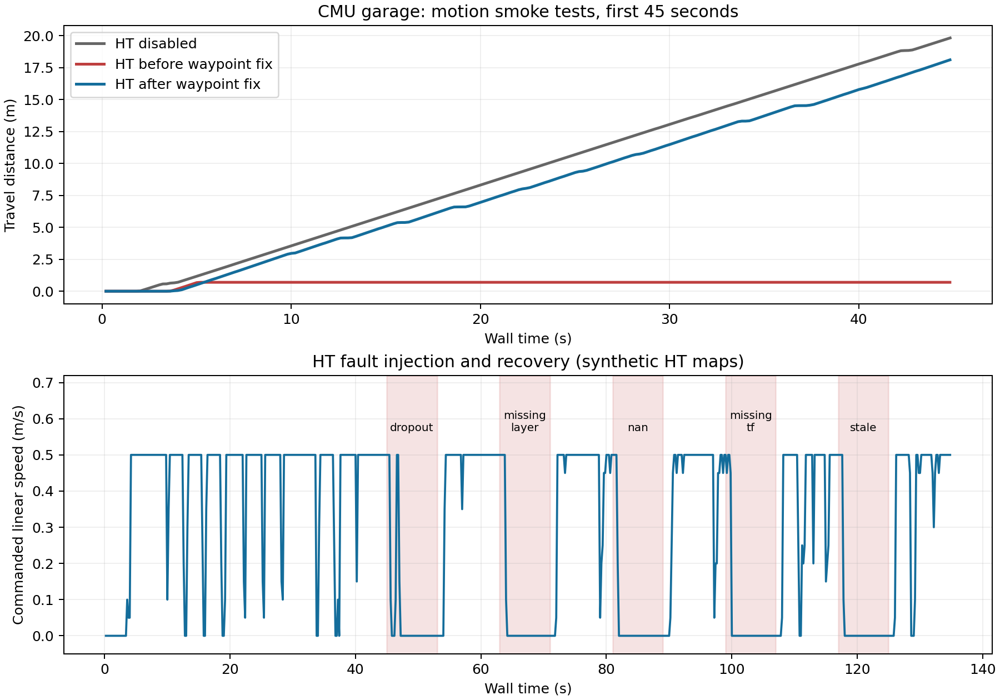

# CMU Jazzy 仿真验证与修复

验证时间：2026-09-14 至 2026-09-15。

2026-09-20 补充：后续重复探索实验发现了另一处网格拐角停滞，已另行定位处理。本文记录的是之前的功能验证；探索效率、稳定性及后续修复复测见 [EXPERIMENT_REPORT.md](EXPERIMENT_REPORT.md)。

**结论：原压缩包不能直接正确编译，修复后可以在 CMU Garage 中闭环运动。** 开启 HT 的修复版在约 135 秒测试中行驶 **40.56 米**，期间包含五次故障注入及恢复。该结果验证的是 TARE + HT 代价接口和 waypoint 执行链路；输入为测试脚本生成的八方向概率地图，没有运行真实 HT/ELE 推理模型，也没有完成整座车库探索或实车验证。

## 实际改动

1. **修复包识别与 Jazzy 编译依赖。** 删除 `src/CMakeLists.txt` 中残留的 ROS 1 Melodic 路径文本；它会让 colcon 把 `src` 当作包，漏掉真正的 `tare_planner`，出现“0 packages finished”。去掉硬编码 Humble 头文件路径，补齐 GridMap 的 Eigen 插件头文件与 `planning_env` 的 HT 依赖。全新构建时先查找系统 Eigen，避免 OR-Tools 附带的 Eigen 配置导致 `EIGEN_MPL2_ONLY: linker input file not found`。
2. **下载并替换匹配的 OR-Tools 完整发行包。** 使用官方 `9.8.3296 / Ubuntu 22.04 / x86_64` 的头文件、库和 CMake 所需工具，恢复 `.so` 符号链接。在本机 Ubuntu 24.04 实际编译和运行通过。改用 `ortools::ortools` 传递 Protobuf/Abseil 等依赖；原先只链接 `.so`，HT 的 `mutable_time_limit()` 会触发 `google::protobuf::Arena::Allocate` / `Duration` 未定义符号。普通安装会携带 OR-Tools 运行库，并通过 `$ORIGIN` 查找，不依赖构建目录。来源和 SHA256 见 [OR-Tools SOURCE.md](src/tare_planner/or-tools/SOURCE.md)。
3. **修复开启 HT 后的运动停滞。** 初次仿真行驶 0.698 米后一直追踪距离 0.163 米的起始网格点，HT 的 0.15 米到达阈值小于 CMU 的 0.2 米停车阈值。现在跳过开头的 ROBOT 网格锚点，使用水平到达距离 `ht_waypoint_reached_distance=0.3` 米；太近的后续路径节点也会被消费。实际目标段仍经过局部范围、几何碰撞、视线和 HT 支持范围检查。
4. **修复地图输入校验。** 拒绝 NaN/Inf 姿态；在调用 GridMap 转换器前检查几何尺寸、数组布局/长度、起始索引和坐标。原转换器会直接访问布局及原始数组，不能依靠异常捕获处理所有畸形输入。
5. **补充可复现验证工具和记录。** 新增 ROS 集成测试、独立仿真启动、HT 地图/故障发布器、轨迹与控制输出记录、结果断言及绘图脚本。测试进程退出时清理自己启动的 Gazebo 进程组。
6. **修复 CMU 启动文件的空格路径问题。** 仿真仓库已应用对应修复，补丁保存在 [validation/cmu_jazzy.patch](validation/cmu_jazzy.patch)。它给 Gazebo 场景文件路径添加正确的引号。

## 实测结果

环境：Ubuntu 24.04.4、ROS 2 Jazzy、GCC 13、x86_64、NVIDIA RTX 5060 Ti。CMU 仿真仓库使用 `jazzy` 分支，提交 `8313dfed10533787582be8a6044483fe3299622f`，以及上述路径补丁。模型为 CMU 官方 Garage，使用其 Gazebo 激光、里程计、地形分析、局部规划和路径跟随模块；自主速度设置为 0.5 m/s。

| 测试 | 时长（墙钟） | 行驶距离 | 结果 |
|---|---:|---:|---|
| 关闭 HT 的基线 | 49.8 s | 22.20 m | 正常运动 |
| 修复 waypoint 前，HT 开启 | 134.8 s | 0.70 m | 复现起始点停滞 |
| 修复后，HT 开启及故障注入 | 134.8 s | 40.56 m | 运动、停步和恢复均通过 |
| 未标定，持续发布有效测试地图 | 14.8 s | 0.00 m | 14 次 waypoint 保持当前位置，未发布允许前进状态 |
| 全新构建、普通安装后的 HT 节点 | 19.8 s | 5.28 m | 安装目录内的 OR-Tools 加载及闭环运动通过 |

这些是功能验证，不是探索效率或 HT 优越性对比；各试验不代表相同探索任务的完成结果。修复后第一段 45 秒有效输入期间行驶 18.11 米，未出现原先的永久停滞。

在 HT 修复版测试中，五种异常各持续 8 秒，每次随后恢复有效输入：

| 异常 | 首次观察到 allowed=false | 异常开始 3 秒后的状态 |
|---|---:|---|
| 停止发布 HT | 1.81 s | 目标保持、速度为零 |
| 缺少 `ht_dir_7` | 0.81 s | 目标保持、速度为零 |
| 概率包含 NaN | 1.01 s | 目标保持、速度为零 |
| 缺失地图 TF | 0.81 s | 目标保持、速度为零 |
| 地图时间戳落后 5 秒 | 0.81 s | 目标保持、速度为零 |

观测采样间隔为 0.2 秒，以上不是实时响应上界。停发 HT 后还行驶约 0.51 米才停止，符合当前 1 秒地图超时及 1 Hz 规划周期的非即时响应。各次恢复有效地图后的 10 秒阶段均重新行驶超过 3.6 米。

编译：CMU 9 个包通过，`tare_planner` 通过。测试：**41 项独立核心检查、9 项 ROS 集成测试通过**；`colcon test-result` 汇总为 11 tests，0 failures。ROS 测试覆盖循环缓冲区、旋转和平移 TF、方向代价、无效概率、缺层、缺 TF、过期/未来时间、NaN 姿态、畸形数组和参数校验。构建仍有上游的弃用接口、符号比较和 CMake policy 警告。

证据：

- [汇总 JSON](validation/results/summary.json)
- [HT 修复版原始采样](validation/results/ht_fixed/metrics.json)
- [测试输出](validation/results/colcon_test.log) / [ROS 测试 XML](validation/results/ht_ros_test.xml)
- [对比图 PNG](validation/results/motion_and_faults.png) / [PDF](validation/results/motion_and_faults.pdf)



## 复现

以下假定两个仓库为相邻目录 `HT_Explo` 和 `cmu_ws`，系统已安装 Jazzy 及 `rosdep`、`colcon`。本仓库已经包含上述匹配版本的 OR-Tools，无需重复替换。

```bash
git clone --branch codex/ht8dir-v1 git@github.com:CQULzz/HT_Explo.git HT_Explo
git clone --branch jazzy https://github.com/HongbiaoZ/autonomous_exploration_development_environment.git cmu_ws
git -C cmu_ws checkout 8313dfed10533787582be8a6044483fe3299622f
git -C cmu_ws apply ../HT_Explo/validation/cmu_jazzy.patch

# CMU 官方场景模型：该链接与仓库下载脚本使用相同的文件 ID。
curl -fL --retry 2 'https://drive.usercontent.google.com/download?id=1V4MWCD3qYLr3RFLLATbqAh_lXKcCU39C&export=download&confirm=t' -o cmu_environments.zip
unzip cmu_environments.zip -d cmu_ws/src/vehicle_simulator/mesh

source /opt/ros/jazzy/setup.bash
rosdep install --from-paths cmu_ws/src HT_Explo/src --ignore-src -r -y
cd cmu_ws
MAKEFLAGS=-j3 colcon build --symlink-install --parallel-workers 3 --cmake-args -DCMAKE_BUILD_TYPE=Release
source install/setup.bash
cd ../HT_Explo
MAKEFLAGS=-j3 colcon build --packages-select tare_planner --symlink-install --cmake-args -DCMAKE_BUILD_TYPE=Release
source install/setup.bash
ROS_DOMAIN_ID=72 colcon test --packages-select tare_planner
colcon test-result --verbose

# 每条命令会启动并停止一套独立 CMU Garage 仿真。
python3 validation/run_case.py --disabled --phases off:50 --output validation/results/baseline --domain 73
python3 validation/run_case.py --phases valid:45,dropout:8,valid:10,missing_layer:8,valid:10,nan:8,valid:10,missing_tf:8,valid:10,stale:8,valid:10 --output validation/results/ht_fixed --domain 73
python3 validation/run_case.py --uncalibrated --phases valid:15 --output validation/results/uncalibrated --domain 74
python3 validation/summarize.py
python3 validation/plot_results.py
```

Jazzy CMU 仿真默认给导航数据使用墙钟时间，因此上述 TARE 和测试 HT 输入统一使用 `use_sim_time=false`。不要只给 TARE 单独打开仿真时钟。离线回放或改变仿真时钟策略时，需要一起调整所有输入与 TF。

`validation/sim_probe.py` 明确是合成地图测试工具，不能当作 HT 推理输出。默认生产配置仍保持 `ht_directions_calibrated=false`；真正接入 HT 时需要发布正确的八方向层、`ht_valid`、时间戳和 TF，并完成通道方向标定。仅更换 OR-Tools 不会自动产生 HT 地图。

## 来源

- 用户压缩包 SHA256：`610c49e1e937159db39a26003d5827a42e6b34ff3769f22d12dd753ba154d971`。
- 修复基于用户仓库提交 `46f9642221ff7e251e601818a45fe041831b928c`，保留其提交历史。
- [指定的 CMU 仿真仓库](https://github.com/HongbiaoZ/autonomous_exploration_development_environment/tree/jazzy)、[CMU 项目说明](https://www.cmu-exploration.com/)。
- 原始 `release_manifest.json` 和 `ht_v1.patch` 保留为第一版来源记录，本次修复由 Git 差异及本文记录。
