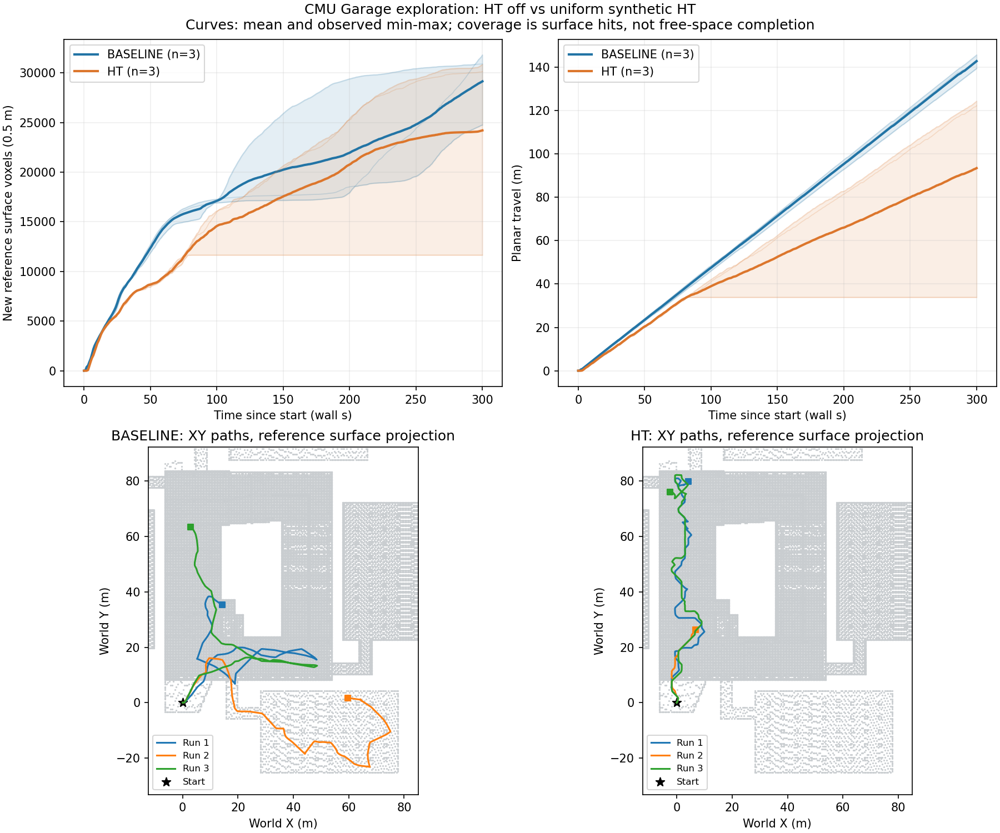
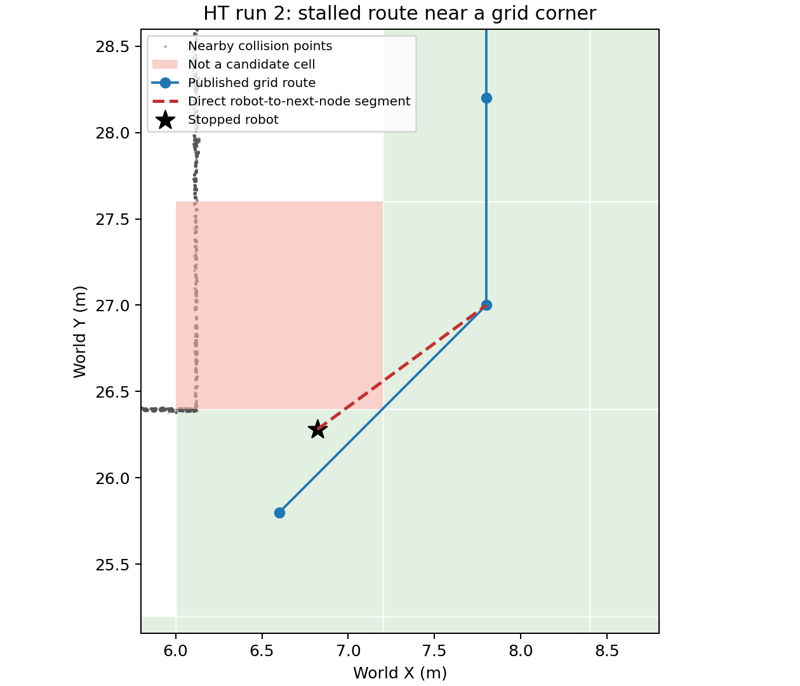

# 初始版本探索对比（2026-09-20）

规划器提交：`c4b7a41`。每组 3 次，每次 300 秒。此记录保留修复前的数据。

| 条件 | 重复 | 新增参考体素 | 平面行程 / m | 连续低速区间总时长 / s |
|---|---:|---:|---:|---:|
| baseline | 1 | 24746 | 145.69 | 0 |
| ht | 1 | 30840 | 124.34 | 0 |
| ht | 2 | 11646 | 33.87 | 219 |
| baseline | 2 | 30891 | 143.35 | 0 |
| baseline | 3 | 31802 | 139.48 | 0 |
| ht | 3 | 30122 | 122.25 | 0 |

三次基线均无长时间低速停留；HT 第 2 次在约 81 秒后持续停止，直到固定时长结束。不能用成功运行的一次结果代表稳定探索能力。此失败保留在均值和图中。

记录到的局部路径非空，且有效合成 HT 和激光仍持续输入。机器人到下一路径节点的直线穿过不可用拐角网格；路径图允许该对角连接，执行阶段却拒绝该段，二者约束不一致。

完整采样见各次 `metrics.json`，独立重算结果见 [summary.json](summary.json)。表面命中率不是自由空间探索完成率。

